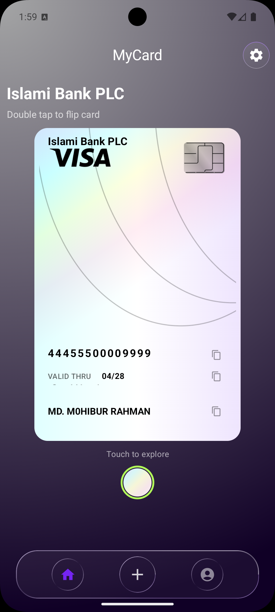
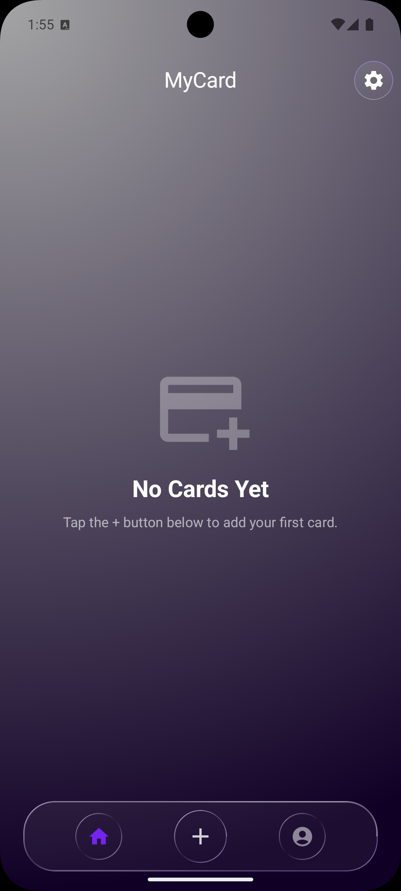
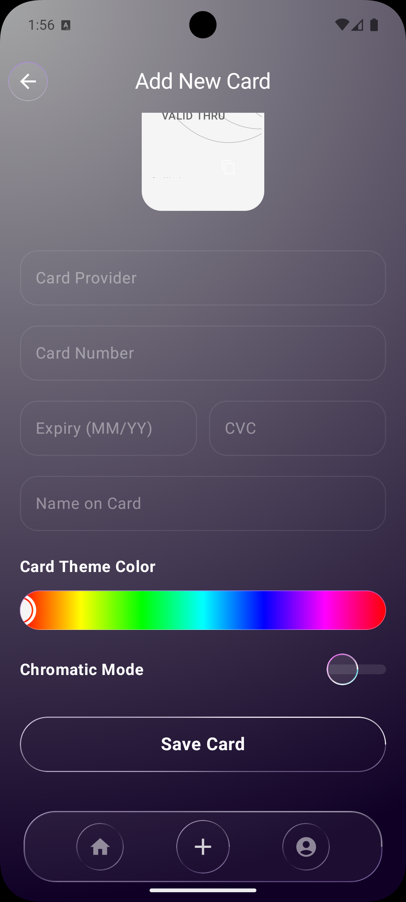
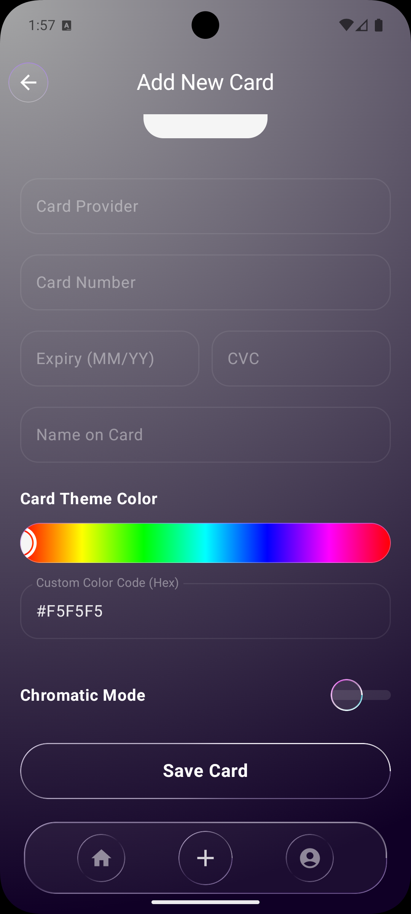
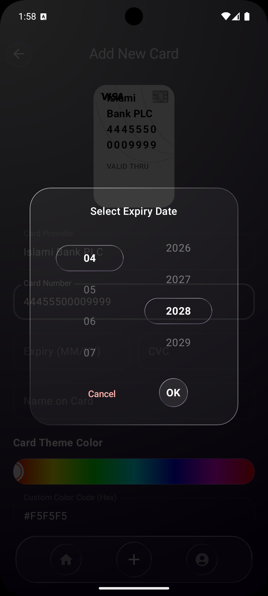
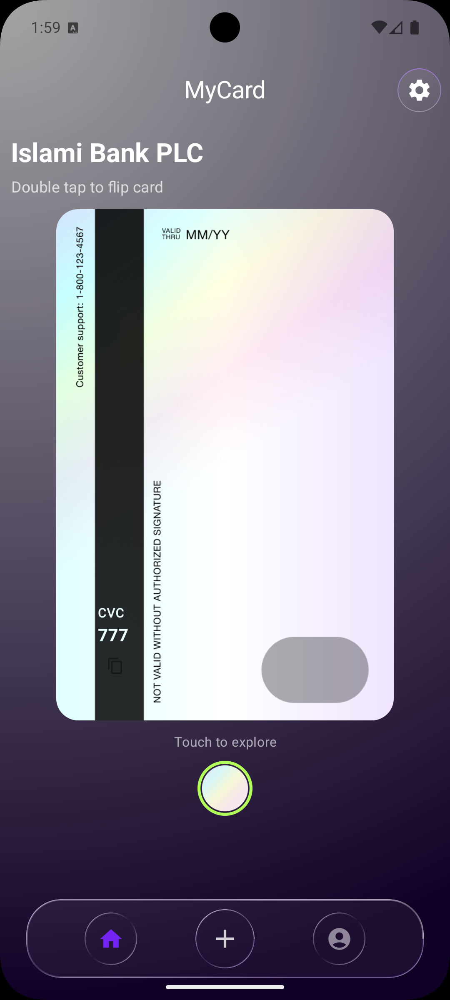
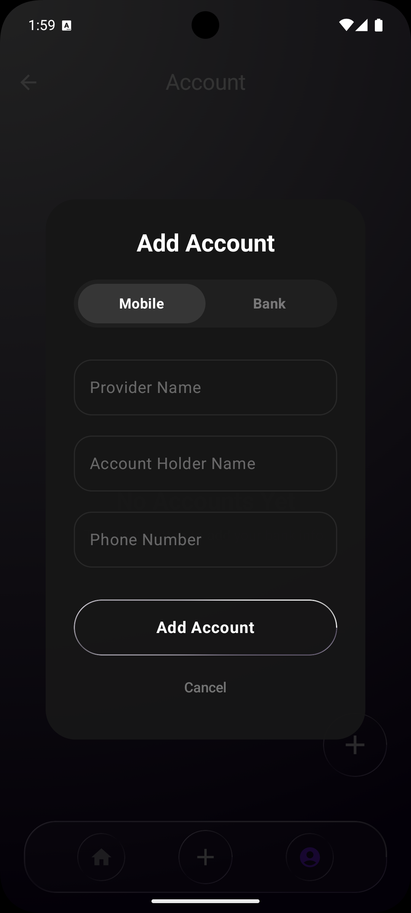
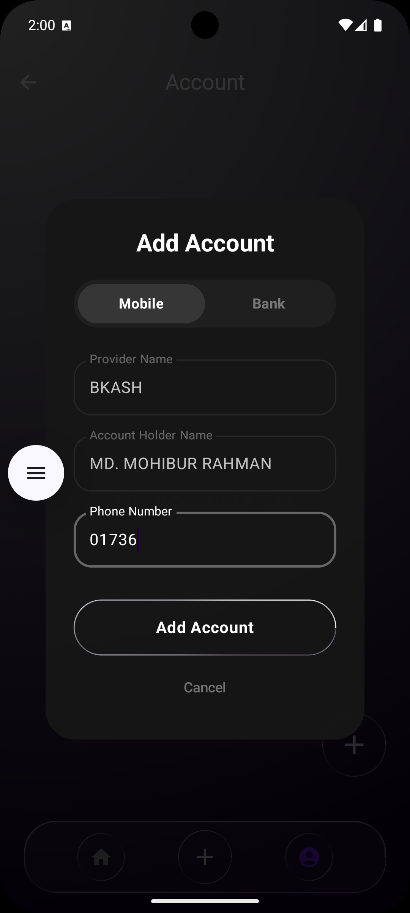

<p align="center">
  
</p>

<h1 align="center">MyCard</h1>

<p align="center">
  A fully offline Android vault for your bank cards, mobile banking, and bank accounts —
  presented in a premium, 3D liquid-glass interface.
</p>

<p align="center">
  <a href="https://github.com/MugdhaRahman/MyCard-JetpackCompose"></a>
  <a href="#"></a>
  <a href="#"></a>
  <a href="dist/MyCard-v1.0.apk"></a>
</p>

---

## ✨ Why MyCard?

We all carry a stack of plastic in our wallets and a dozen banking apps on our phones.
Finding one card number or routing number mid-transaction is a mini-frustration.

MyCard brings **all of it into one beautiful, private place** — with a premium 3D
card experience you'll actually enjoy opening.

## 💳 Features

- **Premium 3D cards** — drag to tilt with physics springs, tap to inspect, double-tap to flip and reveal the CVC.
- **Store everything** — unlimited cards, mobile-banking (phone / email), and bank (account + routing) details.
- **One-tap copy** for card number, expiry, CVC, account numbers, and more.
- **Fully customizable** — a complete hue picker plus raw **HEX input**, and a **Chromatic** holographic mode for a dynamic light-on-the-card effect.
- **Manage & edit** everything from a liquid-glass UI with blur, lens, and vibrancy effects.
- **Empty-state onboarding** — a clean guided start with a floating "+" action.

## 🔐 Privacy by Design

- **100% offline** — everything lives on your device. No servers, no accounts, no tracking.
- **Local-first persistence** with Room.
- Your banking data **never leaves your phone**.

## 📸 Screenshots

| Home / Cards | Card Creator | Accounts | Manage Cards |
| :---: | :---: | :---: | :---: |
|  |  |  |  |
|  |  |  |  |

## 📲 Download

Grab the latest signed APK from the [Releases](https://github.com/MugdhaRahman/MyCard-JetpackCompose/releases)
page, or install directly:

```
📦 dist/MyCard-v1.0.apk
```

> **Note:** Android may ask you to allow installing apps from unknown sources if you're not
> using Google Play. On-device storage means all data stays local.

## 🛠️ Tech Stack

- **100% Kotlin**
- **Jetpack Compose + Material 3**
- **Room** — local-first persistence
- **Koin** — dependency injection
- **Type-safe Navigation Compose**
- **Kyant Backdrop** — liquid-glass / blur / lens / vibrancy effects
- **minSdk 24 → targetSdk 37**

## 🧱 Architecture

```
app/src/main/java/com/mrapps/mycard/
├── data/          # Room entities, DAOs, repositories
├── di/            # Koin modules
├── navigation/    # Type-safe NavRoute definitions
├── ui/
│   ├── theme/     # Colors, typography, liquid-glass components
│   ├── components/ # Reusable glass UI pieces (buttons, FAB, switches)
│   └── screens/    # Home, Card/Vault, Accounts, Settings + ViewModels
```

## 🚀 Build

```bash
# Build a debug APK
./gradlew assembleDebug

# Build a release APK
./gradlew assembleRelease
```

The APK will be in `app/build/outputs/apk/<variant>/`.

## 🤝 Contributing

This is a hobby/portfolio project built for learning — but issues and ideas are welcome.
Open an issue or submit a PR.

## 📄 License

Distributed under the MIT License. See `LICENSE` for details.

---

<p align="center">
  Made with ☕ and Jetpack Compose
</p>
